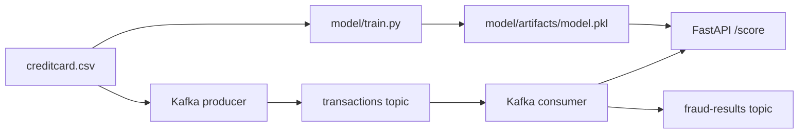

# Architecture

SentinelPay is split into four small layers:

1. **Training**: `model/train.py` loads `data/creditcard.csv`, scales `Amount`, applies SMOTE, trains Isolation Forest, evaluates the test split, and writes `model/artifacts/model.pkl`.
2. **Scoring API**: `api/main.py` exposes FastAPI endpoints. `api/scorer.py` loads the model artifact once and performs inference.
3. **Streaming**: `streaming/producer.py` replays CSV rows into Kafka. `streaming/consumer.py` calls `/score` and publishes enriched results.
4. **Ops**: `docker-compose.yml` starts Kafka and Zookeeper. GitHub Actions runs tests, bytecode compilation, and Compose validation.

## Runtime Endpoints

- `GET /`: discovery payload
- `GET /health`: model load state and uptime
- `GET /model`: model metadata and training metrics, when available
- `GET /metrics`: in-memory scoring counters and latency percentiles
- `POST /score`: score one transaction
- `POST /score/batch`: score up to 1000 transactions

## Design Choices

- Isolation Forest is used as an anomaly detector because fraud labels are rare and anomaly scores are useful for triage.
- SMOTE is used during training to give the unsupervised model more exposure to minority-class-like regions.
- The API keeps metrics in memory to stay dependency-light. Production deployments should export metrics to Prometheus or OpenTelemetry.
