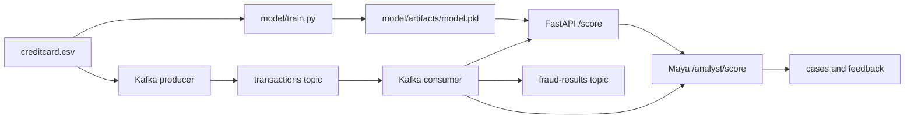

# Architecture

SentinelPay is split into six small layers:

1. **Training**: `model/train.py` loads `data/creditcard.csv`, scales `Amount`, applies SMOTE, trains Isolation Forest plus a supervised logistic baseline, evaluates the test split, writes reports, and saves `model/artifacts/model.pkl`.
2. **Scoring API**: `api/main.py` exposes FastAPI endpoints. `api/scorer.py` loads the model artifact once and selects `supervised_baseline` or `isolation_forest`.
3. **Analyst layer**: `api/analyst.py` turns model output into a human review object with severity, queue, reason codes, and recommended actions.
4. **Investigation workflow**: `api/cases.py` keeps demo cases, dispositions, feedback, and retraining candidates.
5. **Streaming**: `streaming/producer.py` replays CSV rows into Kafka. `streaming/consumer.py` calls `/score` or `/analyst/score` and publishes enriched results.
6. **Ops**: `docker-compose.yml` starts Kafka, Zookeeper, the API, producer, and consumer. GitHub Actions runs tests, bytecode compilation, and Compose validation.

## Runtime Endpoints

- `GET /`: discovery payload
- `GET /health`: model load state and uptime
- `GET /model`: model metadata and training metrics, when available
- `GET /metrics`: in-memory scoring counters and latency percentiles
- `GET /metrics/prometheus`: Prometheus text metrics
- `POST /score`: score one transaction
- `POST /score/batch`: score up to 1000 transactions
- `POST /analyst/score`: score one transaction and return Maya's triage report
- `GET /analyst/console`: local analyst console
- `GET /dashboard`: live browser dashboard
- `GET /cases`: fraud investigation cases
- `POST /cases/{case_id}/disposition`: close or escalate a case
- `POST /cases/{case_id}/feedback`: collect analyst feedback for retraining
- `GET /retraining/candidates`: case feedback export surface

## Design Choices

- Isolation Forest is used as an anomaly detector because fraud labels are rare and anomaly scores are useful for triage.
- Logistic regression is included as a supervised baseline because labels exist in the Kaggle dataset and PR-AUC is the right comparison point for rare positive classes.
- SMOTE is used during training to give the unsupervised model more exposure to minority-class-like regions.
- The API keeps metrics in memory to stay dependency-light. Production deployments should export metrics to Prometheus or OpenTelemetry.
- Analyst Mode is deterministic and rule-based so it stays auditable and does not require external LLM credentials.
